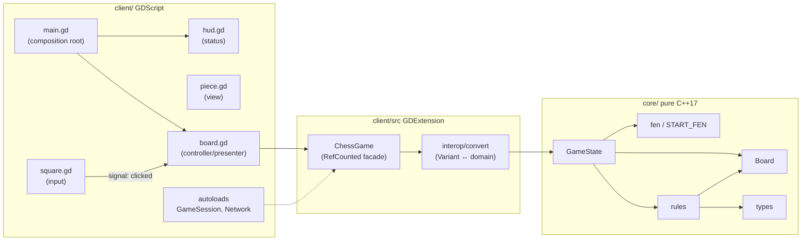
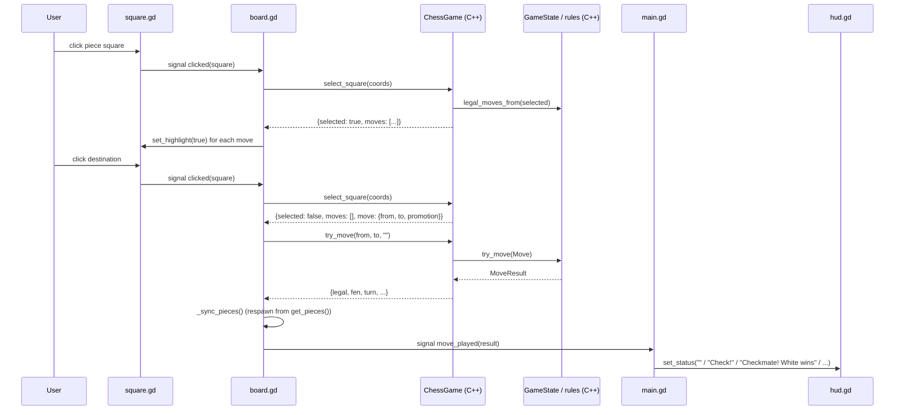

# Architecture

The project follows a hexagonal (ports-and-adapters) layout: a pure domain core with adapters on each side. The Godot client is one adapter; a server is planned as another.

## Structure

Dependency direction is strictly **inward**: GDScript → facade → interop → domain. Nothing in `core/` includes `godot_cpp/*`.

## Layers

| Layer | Location | Responsibility |
|---|---|---|
| Domain | `core/domain/` | Board state, legal move generation, game rules, FEN, undo. Zero dependencies beyond the C++ standard library. |
| Interop | `client/src/interop/` | Converts between Godot `Variant` types (`Vector2i`, `String`, `Dictionary`, `Array`) and domain types (`Square`, `Color`, `MoveResult`). The only file allowed to see both worlds. |
| Facade | `client/src/chess_game.*` | `ChessGame` (GDCLASS, `RefCounted`): exposes game operations to GDScript and owns the click-selection state machine. |
| Presentation | `client/scenes/` | Builds the board, renders squares/pieces, emits input signals, updates the HUD. Holds no rules. |
| Composition | `scenes/main/main.tscn` | Instantiates Board + HUD and wires `move_played` → status text. |

## Data flow: one move

When `move["promotion"]` is `true`, `board.gd` stops: it stores the move, shows `promotion.tscn` over the promotion square, and only after the player picks a piece makes the **single** `try_move(from, to, piece)` call — no state changed, nothing sent, until then. Escape / right-click / clicking another square cancels via `_cancel_pending()`.

## Key decisions

- **Selection state lives in the facade** (`has_selected`, `selected` in `ChessGame`), not in GDScript. GDScript stays a pure presenter: one method call returns everything needed to render.
- **Full piece respawn on move** (`_sync_pieces` frees and re-instantiates all pieces). Simple and correct for a placeholder renderer; can become incremental updates later without touching the facade.
- **FEN is the state interchange format.** `to_fen()` / `load_fen()` round-trip exactly (tested). The planned network protocol syncs states via FEN rather than reimplementing serialization per side.
- **`server/` will link `core/` via its own SCons build**, the same way `client/SConstruct` pulls in `core/SConscript`. No Godot code is involved there.

## Boundary rules

1. `core/domain/` includes only standard-library headers and its own headers.
2. `godot_cpp` types appear only under `client/src/` (and never leak into `core/`).
3. GDScript may construct `ChessGame.new()` only in `board.gd` and autoloads; every other script receives data through signals or method calls from those owners.
4. Layer choice for new logic: *does it decide anything about chess?* → C++. *Does it decide how something looks or reacts to input?* → GDScript. *Does it translate between them?* → interop.
